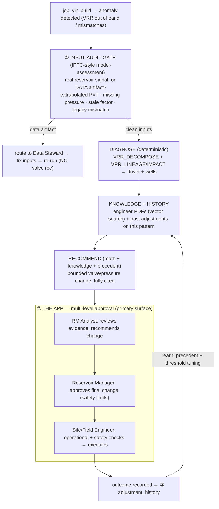
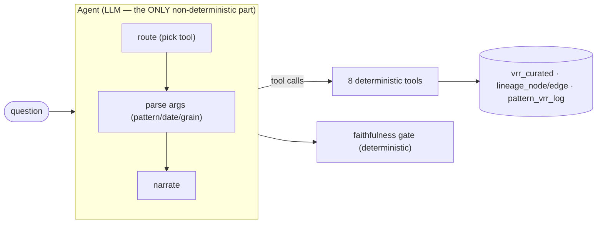

# VRR Decision-Support — Master Design

**Status:** design (supersedes the "VRR chat agent" framing for production use)
**Reframe:** from a *VRR reasoning chat agent* → an **app-centric Reservoir Management
decision-support system**. The VRR number is the *trigger*; the product value is the
**governed decision** to adjust a valve/pressure — grounded in deterministic math,
engineers' tacit knowledge (RAG), historical precedent, and **multi-level human approval**.
Chat/Genie remains, but **secondary** (embedded ad-hoc Q&A inside the app).

Builds on what already exists in this repo:
- Deterministic VRR engine + value-level lineage (`src/vrr_agent/*`, `vrr_agent.lineage_*`).
- The **monitor → diagnose → draft → approve → learn** pattern from `agents/collections/`.
- PDF → parse → chunk → embed → Vector Search from `src/contract_vector_search/`.
- Input-confidence signals already emitted: `pvt_method`, `missing_input`, `any_extrapolated`.
- `cdp_*` UC groups for role-based approval.

---

## 1. End-to-end flow

---

## 2. Phase-1 vertical slices (build these first — they unlock the rest)

### Slice A — Input-audit gate (inspired by Reservoir Model Assessment Agents, IPTC 26IPTC/794894)
Before ANY recommendation, validate the inputs feeding the VRR — auto-audit, the way the
paper auto-audits simulation-model inputs. Reuse the signals already on `completion_contrib`
(`pvt_method` extrapolated, `missing_input`, `any_extrapolated`) + a legacy/reconciliation
mismatch check. Output a verdict per flagged pattern:
- **DATA_ARTIFACT** → route to Data Steward (fix inputs, re-run); do **not** propose a valve change.
- **REAL_SIGNAL** → proceed to diagnose + recommend.
This is the single highest-value guardrail: never adjust a valve because of a PVT-extrapolation bug.
Artifact: `src/vrr_agent/audit.py` (rules) + `vrr_agent.input_audit` table + a `VRR_AUDIT` surface.

### Slice B — Multi-stage `action_queue` (staged approval state machine + RBAC)
Extend the collections `action_queue` idea into a **staged workflow**; each stage = a role + audit,
all seeing the same evidence bundle (decompose driver, lineage proof, knowledge citations,
historical precedent, audit verdict).

| Stage (status) | Role (UC group) | Action | Gate |
|---|---|---|---|
| `proposed` | system | draft rec + evidence bundle | input-audit = REAL_SIGNAL |
| `analyst_review` | `cdp_rm_analysts` | Analyst edits/recommends | must cite evidence |
| `rm_approved` | `cdp_reservoir_mgrs` | RM approves final change | within safety limits |
| `site_check` | `cdp_field_engineers` | operational/safety checks | valve rate · injection pressure · fracture gradient |
| `executed` → `outcome` | field | adjustment made, result recorded | logged to history |

Tables: `vrr_agent.action_queue` (staged) + `vrr_agent.action_audit` (every transition, who/when).
(Roles are a sound default; refine during app iteration — they're status values + RBAC.)

### Slice C — Knowledge-ingestion index (reuse `contract_vector_search`)
Ingest engineers' tacit knowledge as PDFs → parse → chunk → embed (`databricks-gte-large-en`)
→ Vector Search index `reservoir_knowledge`. Near-verbatim reuse of `src/contract_vector_search/`.
**Frame of what the knowledge carries** (the "in their brain" taxonomy):

| Knowledge type | Example | Role in the decision |
|---|---|---|
| Well/reservoir behavior | "PROD_WELL_003 gasses out above 2800 psi" | qualifies the free-gas driver |
| Operational constraints | valve max rate; well on ESP/artificial lift | bounds the recommendation |
| Safety / regulatory | max injection pressure; fracture gradient; MER | hard limits on the change |
| Field / geologic context | fault compartmentalization; aquifer support; offset-well interference | explains VRR move beyond the math |
| Adjustment heuristics | "don't chase daily VRR noise; act on 3-mo trend" | when to act / not |
| Prior studies | PVT lab reports; sim-model assumptions; surveillance plots | validates inputs (feeds Slice A) |

---

## 3. Recommendation = math + knowledge + precedent
The proposal is assembled deterministically-then-narrated (same "LLM drafts, deterministic gate"
principle):
- **Math** (deterministic): `VRR_DECOMPOSE` → what changed & why; `VRR_LINEAGE/IMPACT` → which wells/inputs.
- **Knowledge** (RAG): retrieve relevant engineer notes/constraints/heuristics from `reservoir_knowledge`.
- **Precedent** (history): retrieve similar past anomalies + the adjustment made + its outcome.
→ a **bounded** valve/pressure change with citations to all three. The LLM phrases; it never
computes the numbers and may only claim a driver the decomposition supports.

## 4. Historical adjustments (case-based reasoning + learning)
`vrr_agent.adjustment_history(pattern, anomaly, driver, change_made, pre_vrr, post_vrr, approved_by, outcome, ts)`
- **At recommend-time**: "last 3 times this pattern over-replaced from a pressure drop, injection
  was cut X% → VRR settled to Y" → precedent cited in the proposal.
- **As learning**: outcomes tune thresholds + the recommended magnitude (did the last change over/under-correct?).

## 5. Reuse map (this is an extension, not a rebuild)
| Need | Reuse |
|---|---|
| PDF → vector knowledge | `src/contract_vector_search/` (RAG, VS index, masking) |
| draft → approve → learn + queue | `agents/collections/` |
| deterministic diagnosis | VRR tools (`VRR_DECOMPOSE`/`LINEAGE`/`IMPACT`) |
| input-confidence flags | `completion_contrib.pvt_method`/`missing_input`, `any_extrapolated` |
| role-based stages | `cdp_*` UC groups |
| app shell | the §9.5 report app pattern (Streamlit / Databricks App) |
| logged transformation ("how is it calc'd") | `vrr_agent.pattern_vrr_log` + `VRR_EXPLAIN_CALC` |

## 5.1 Agent tools inventory (8 tools, all deterministic)
Backed by 4 UC functions (`vrr_get`, `vrr_lineage`, `vrr_impact`, `vrr_trace`).

| # | Tool | Purpose | Backing |
|---|---|---|---|
| 1 | `VRR_LIST_PATTERNS` | discovery — what patterns/periods exist | `pattern_vrr_monthly` |
| 2 | `VRR_OVERVIEW` | portfolio — all patterns vs target, ranked by drift | `pattern_vrr_*` |
| 3 | `VRR_GET` | a specific VRR value + target/prior/peer refs | `vrr_get` UC fn |
| 4 | `VRR_DECOMPOSE` | exact LMDI attribution ("why did it change") | `completion_contrib` |
| 5 | `VRR_LINEAGE` | on-the-fly root-trace tree | `completion_contrib` |
| 6 | `VRR_LINEAGE_GRAPH` | persisted root-trace | `vrr_trace` UC fn / `lineage_edge` |
| 7 | `VRR_IMPACT` | what-if / impact (forward reachability) | `vrr_impact` UC fn / `lineage_edge` |
| 8 | `VRR_EXPLAIN_CALC` | retrieve the actual logged build SQL | `pattern_vrr_log` |

## 5.2 Determinism model
**Deterministic (same input → same output):** all 8 tools, the VRR math (`vrr_build.sql`/
`physics.py`), the lineage-graph build, and the faithfulness gate. The numbers people act on
never vary.

**Non-deterministic (the LLM), in exactly three places:**
1. **Tool routing** — which tools it calls, in what order.
2. **Argument extraction / parsing** — turning `"UNITY April"` into the exact fields a tool
   needs: `{pattern: "PUNITY", date: "2026-04-01", grain: "monthly"}` (name→id, month→date,
   grain default). Today the LLM does this → it can misparse.
3. **Narration** — phrasing the final answer (numbers are safe; wording varies).

**How to shrink each:**
- Routing → a deterministic **intent router** (classify → fixed tool pipeline per intent).
- Parsing → **deterministic date parser + `resolve_pattern` against the catalog + validate**;
  clarify if the parsed pattern/date isn't real. Don't trust the LLM's free-form arg fill.
- Narration → **templated output** (LLM polish only) + a **number-level faithfulness gate**
  (every figure in the answer must exist in the tool payload) + **cache** per (intent, pattern,
  date, run_id).

Principle: make the LLM do the least — ideally only NL→(validated intent+args) and light polish.

## 5.3 Genie integration (a choice; not yet wired)
Genie is NOT currently in the workflow (today = custom agent + 8 tools). Two opposite ways to
combine — pick one:

| | Option A — Genie *inside* our agent | Option B — our functions *inside* Genie (recommended) |
|---|---|---|
| Shape | agent keeps 8 tools + a `GENIE_QUERY` tool; routes known→tools, ad-hoc→Genie | Genie is primary; register `vrr_get/impact/trace` UC functions + `vrr_*` tables in a Genie space; thin/no custom agent |
| Pros | one entry point, deterministic core kept | least to maintain, native NL→SQL flexibility |
| Cons | more agent code to maintain | lose the faithfulness gate unless `vrr_decompose` is kept as a UC function |
| Make deterministic | intent router + templates (5.2) | **Metric Views** (VRR/target/verdict) + **certified queries** + read-only guardrails |

Recommendation: **Option B** for production (Genie chats over the governed tables + our UC
functions), keeping the deterministic UC functions for the answers that must be exact.

## 6. Guardrails (non-negotiable — physical reservoir)
- **Advisory only** — the app recommends; **field ops execute**. Never autonomous well/valve control.
- **Multi-level human approval mandatory** (Analyst → RM → Site).
- **Safety-limit gate** at RM + Site stages (injection pressure, fracture gradient, valve rate).
- **Input-audit first** — never recommend on suspect inputs.
- **Every recommendation cites** its math (decompose/lineage), knowledge (PDF citations), and
  precedent (history) — no black-box advice. Full audit of every stage transition.

## 7. Build order
1. **Phase 1 (now):** Slice A (input-audit gate) + Slice B (multi-stage action_queue) + Slice C
   (knowledge index) — the load-bearing foundations.
2. **Phase 2:** the recommendation assembler (math+knowledge+precedent) + `adjustment_history`.
3. **Phase 3:** the Databricks App (staged approval UI, evidence bundle, citations) + notifications
   (App queue / SQL Alert / Teams webhook — no custom SMTP).
4. **Phase 4:** learning loop (outcomes → threshold/magnitude tuning) + agent-eval.

## 8. Open questions
- Safety-limit source: a policy table (`vrr_agent.safety_limits`) per pattern/well, or from the knowledge PDFs?
- Reconciliation baseline for "mismatch": vs legacy VRR, vs target, or vs a sim-model expectation?
- Notification channel for the RM: Databricks App only, SQL Alert email, or Teams/Slack webhook?
- Multi-asset rollout: one app across assets, or per-asset spaces?
